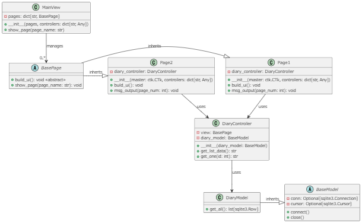

# Template_customtkinter_mvc
customtkinterのmvcパターン開発のテンプレートです。

## 環境
- 言語:python
- 外部モジュール：customtkinter
- DB:sqlite3

## アーキテクチャ
 mvcパターンを採用しており、それぞれ下記のモジュールにそれぞれのクラスを定義します。
 - ビュー：views.py & pages.py(Presentation Layer)
 - コントローラ：controllers.py(Business Logic Layer)
 - モデル：models.py(DataAccess Layer)


## クラス
クラス構成は下記のようになっております。

| クラス名 | 種類 | 説明 | 備考 |
| -- | -- | -- | -- |
| MainViewクラス | ビュー | Pageクラスを管理 | ページの表示・遷移など |
| Pageクラス | ビュー | 画面UIの生成 & UI更新担当 | 抽象クラス有 |
| Contorllerクラス | コントローラ | ビジネスロジックを担当 |  |
| Modelクラス | モデル | DB連携を担当 | 抽象クラス有 |



## モジュール構成
基本的に作成した各クラスをmain.py(エントリポイント)で生成し、それぞれ書くクラス独立した状態を保ちつつ連携を行います。


## 使い方
※下記はmain.pyです。
1. モデルとコントローラはアプリDBの使用するテーブルごとに作成する。

1. 作成したコントローラはmain()関数でインスタンス化する
    ```python
    def main():
    # モデルを生成
    diary_model = DiaryModel()
    
    # コントローラーを生成
    diary_controller = DiaryController(diary_model)
    ```
1. コントローラのインスタンスを生成したら、下記に作ったPageクラスと一緒に渡す
    ```python
    # ビューにページとコントローラーを設定　※MainViewに関連するすべてのコントローラを渡す
    main_view = MainView(pages=[Page1, Page2], controllers={
        "diary": diary_controller,
    })
    
    # 生成したコントローラにView設定　※MainViewに関連するすべてのコントローラ
    diary_controller.view = main_view
    ```
1. 最初に表示したいページを下記のように設定する。
    ```python
    # アプリケーション開始
    main_view.show_page("Page1") # 最初に表示したいページを表示
    main_view.mainloop()
    ```
## Pageクラスの作り方
下記のクラスを抽象クラスを継承して作る。

pages.py
```python
class BasePage(ctk.CTkFrame, ABC):
    def __init__(self, master:ctk.CTk|tk.Tk, **kwargs) -> None:
        super().__init__(master, **kwargs)

    @abstractmethod
    def build_ui(self):
        """UIを構築するための抽象メソッド"""
        ...
        
    def show_page(self, page_name:str) -> None:
        '''ページ遷移するメソッド'''
        self.master.show_page(page_name)
```

build_ui()メソッドを使ってuiを作る。
ページ更新用のメソッドもここに関数を使ってボタンなどに設定する。
データを取得したいコントローラはviewで生成時に渡したcontrollersからページで使用するコントローラをインスタンスメソッドに出す。

```python
class Page1(BasePage):
    def __init__(self, master:ctk.CTk, controllers: dict[str, Any], **kwargs) -> None:
        super().__init__(master, **kwargs)
        # コントローラ設定
        self.diary_controller = controllers['diary']
        # UI生成
        self.build_ui()
        
    def build_ui(self):
        '''UI生成するメソッド'''
        # ここでこのページで表示したいUIを作る
        ...

```

ビューを更新するメソッドはこのPageクラスに定義する。