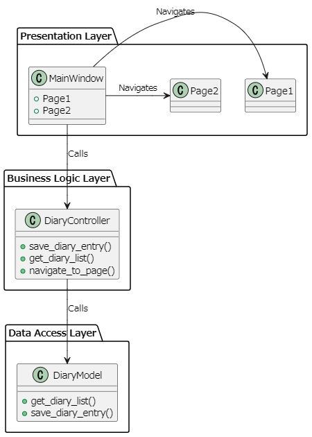

# Template_customtkinter_mvc
customtkinterのmvcパターン開発のテンプレートです。

## 環境
- 言語:python
- 外部モジュール：customtkinter
- DB:sqlite3
- OS:windows11

## アーキテクチャ
 mvcパターンを採用しており、それぞれ下記のモジュールにそれぞれのクラスを定義します。
 - ビュー：views.py & pages.py(Presentation Layer)
 - コントローラ：controllers.py(Business Logic Layer)
 - モデル：models.py(DataAccess Layer)



## クラス
主なクラス構成は下記のようになっております。

| クラス名 | 種類 | 説明 | 備考 |
| -- | -- | -- | -- |
| MainWindowクラス | ビュー | メインウィンドウ表示 & Pageクラスを管理 | ページの表示・遷移など |
| Pageクラス | ビュー | 画面UIの生成 & UI更新担当 | 抽象クラス有 |
| Contorllerクラス | コントローラ | ビジネスロジックを担当 | |
| Modelクラス | モデル | DB連携を担当 | 抽象クラス有 |
| CommonStyeleクラス | ビュー | ウィジェットのスタイル保持する(共通化したいものなど) ||
| Appクラス | ビュー | 各クラスの連携やアプリ起動を担当 |下記のクラス図には載せていません。|


## モジュール構成
基本的に作成した各クラスをmain.py(エントリポイント)で生成し、それぞれ書くクラス独立した状態を保ちつつ連携を行います。


## 画面
- ページ１
ボタンを押すとメッセージでDBから取得した一覧データが表示されます。


- ページ２
ボタンを押すとメッセージボックスに入力したIDのレコードデータが表示されます。


## 事前準備
下記のスクリプトを実行し、「sample.db」を作成し、ルートディレクトリに配置してください。

create_DB.py
```python
import sqlite3

# データベースに接続（ファイルが存在しない場合は自動で作成される）
conn = sqlite3.connect('sample.db')

# カーソルオブジェクトを作成
cur = conn.cursor()

# SQLクエリを実行
sql_query = '''
-- table
DROP TABLE IF EXISTS Diary;

CREATE TABLE IF NOT EXISTS Diary (
    id INTEGER PRIMARY KEY AUTOINCREMENT,
    title TEXT NOT NULL,
    content TEXT,
    create_at TEXT
);

-- data
INSERT INTO Diary (title, content, create_at)
VALUES ('日記1', '内容１', '2024-8-31 16:34'),
       ('日記2', '内容２', '2024-8-31 16:34'),
       ('日記3', '内容３', '2024-8-31 16:34');
'''

# SQLクエリの実行
try:
    cur.executescript(sql_query)
    print("テーブルの作成およびデータの挿入が成功しました。")
except sqlite3.Error as e:
    print(f"エラーが発生しました: {e}")
finally:
    # コミットしてデータを保存
    conn.commit()

    # 接続を閉じる
    conn.close()

```

作成されるDiaryテーブルとサンプルデータ


## 使い方
※下記はmain.pyです。
1. モデルとコントローラはアプリDBの使用するテーブルごとに作成する。

1. 作成したコントローラはmain()関数でAppクラスをインスタンス化し、run()メソッドでアプリ起動する仕組みになっています。
    ```python
    def main() -> None:
        # 各クラスのインスタンス生成
        app = App()
        # アプリ起動
        app.run()
    ```
1. 各クラス間の連携はAppクラスのコンストラクタで行う。
    ```python
    class App:
    def __init__(self) -> None:
        ''' 各クラスの連携(インスタンス生成) '''
        # モデルクラス群を生成
        self.diary_model = DiaryModel()
        
        # コントローラクラス群の辞書型定義
        self.main_controllers={
            "diary": DiaryController(self.diary_model),
        }
        # スタイルクラス群を生成
        self.main_style=CommonStyle()     # 共通スタイル定義クラス
        
        # ウィンドウクラスにコントローラークラス群とスタイルクラスを渡す
        self.main_window = MainWindow(self.main_controllers, self.main_style)
        
        # ページクラス配置
        self.main_window.page_set([Page1, Page2])      # ← 配置したいPageクラスを配列で渡す
    ```
1. BaseWindowクラス(抽象クラス)のpage_setメソッドに各ウィンドウで表示したいPageクラスの配列を渡して配置する。（Appクラスのコンストラクタで呼び出しています。）
    ```python
    class BaseWindow(ctk.CTk, ABC):
        # ・・省略・・
        def page_set(self, pages:Any):
            ''' Pageクラスの配置を行うメソッド '''
            # ページクラス配置
            for PageClass in pages:
                page_name = PageClass.__name__
                page = PageClass(master=self, **self.style.transparent_frame)
                self.pages[page_name] = page
                page.grid(row=0, column=0, sticky="nsew")
    ```
1. 最初に表示したいページはAppクラスのrunメソッドで設定します。
    ```python
    class App:
        # ・・省略・・
        def run(self) -> None:
            ''' アプリ起動処理 '''
            self.main_window.show_page("Page1") # 最初に表示したいページクラス名を渡す
            self.main_window.mainloop()         # 起動
    ```
## Pageクラスの作り方
下記のクラスを抽象クラスを継承して作る。

pages.py
```python
class BasePage(ctk.CTkFrame, ABC):
    def __init__(self, master:ctk.CTk|tk.Tk, **kwargs) -> None:
        super().__init__(master, **kwargs)

    @abstractmethod
    def build_ui(self):
        """UIを構築するための抽象メソッド"""
        ...
        
    def show_page(self, page_name:str) -> None:
        '''ページ遷移するメソッド'''
        self.master.show_page(page_name)
```

build_ui()メソッドを使ってuiを作る。
ページ更新用のメソッドもここに関数を使ってボタンなどに設定する。
データを取得したいコントローラはviewで生成時に渡したcontrollersからページで使用するコントローラをインスタンスメソッドに出す。

```python
class Page1(BasePage):
    def __init__(self, master:ctk.CTk, controllers: dict[str, Any], **kwargs) -> None:
        super().__init__(master, **kwargs)
        # コントローラ設定
        self.diary_controller = controllers['diary']
        # UI生成
        self.build_ui()
        
    def build_ui(self):
        '''UI生成するメソッド'''
        # ここでこのページで表示したいUIを作る
        ...
```

ビューを更新するメソッドはこのPageクラスに定義します。必要なビジネスロジックがあればコントローラクラスのメソッドを使用し、データを取得したりします。

```python
class Page1(BasePage):
    # ...省略...
    def msg_output(self, page_num:int) -> None:
        '''メッセージを出力するメソッド'''
        data:str = self.diary_controller.get_list_data()
        messagebox.showinfo("Information", f"ページ{page_num}のメッセージです。\n\n"
                            + "Diaryデータ：\n"
                            + f"{data}")
```

## CommonStyleクラスの使い方
このクラスは共通のスタイルを保持し、それを各クラスで取り出して使用するために作ったクラスです。
```python
class CommonStyle:
    ''' 共通のスタイルを定義するクラス '''
    def __init__(self) -> None:
        # 文字フォント設定
        self.HEADER_TITLE = (FONT_TYPE, 20, "bold")
        self.FRAME_TITLE = (FONT_TYPE, 17, "bold")
        self.DEFAULT = (FONT_TYPE, 15)
        
        # Windowの背景色
        self.transparent_frame = {
            "fg_color": BASE_COLOR_DARK,
        }
        
        # インラインボタン
        self.inline_btn = {
            "text_color": ("gray10", "#DCE4EE"),
            "fg_color": "transparent",
            "border_width":2,
        }
```

使用するときはCommonStyleのインスタンス変数をとりだして、下記のようにウィジェットの引数に渡すと、定義したスタイルを適応することができます。
```python
class Page1(BasePage):
    def build_ui(self) -> None:
        '''UI生成するメソッド'''
        # Gridレイアウト設定
        self.grid_rowconfigure(0, weight=1)
        self.grid_columnconfigure((0,1), weight=1)

        # ・・省略・・
        
        self.msg_btn = ctk.CTkButton(self, text="メッセージ表示", command=lambda: self.msg_output(1), **self.style.inline_btn)
                                                                                                        # ↑ココ
        self.msg_btn.grid(row=1, column=1, padx=(0,20), pady=40)
```

## コントローラクラスとモデルクラス
下記のように必要なメソッドを定義するだけです。

controllers.py
```python
class DiaryController:
    def __init__(self, diary_model:BaseModel) -> None:
        # モデル変数用意
        self.diary_model = diary_model

    def get_list_data(self) -> str:
        '''Diaryデータを取得するメソッド'''
        # モデルからデータ取得
        data_list:list[Any] = self.diary_model.get_all()
        # データを文字列へ成形する
        data_str_list:list[str] = [
            f"id: {data['id']} title: {data['title']} content: {data['content']} create_at: {data['create_at']}"
            for data in data_list
        ]
        # リストを改行で結合して、一つの文字列にする
        data_str:str = "\n".join(data_str_list)
        
        return data_str
```

models.py
```python
class DiaryModel(BaseModel):
    def __init__(self):
        super().__init__()
        self.t_diary = 'Diary'
    
    def get_all(self) -> list[sqlite3.Row]:
        '''Diaryテーブルから全てのデータを取得するメソッド'''
        data = []
        try :
            # 接続を確立
            self.connect()
            # データ取得の例
            self.cursor.execute(f'SELECT * FROM {self.t_diary}')
            data = self.cursor.fetchall()
        except Exception as e:
            print(f'Error{e}')
        finally:
            if self.conn:
                # 接続を閉じる
                self.close()
        return data
```

<details>
<summary>モジュール一覧</summary>

| モジュール名      | 種類                       | 役割                                                                 | クラス命名ルール                                                               | 依存関係 ※インポートしているモジュール       |
|------------------|----------------------------|----------------------------------------------------------------------|------------------------------------------------------------------------------|------------------------------------------|
| main.py          | エントリポイント（実行ファイル） | ・エントリポイント（実行ファイル）<br>・各クラスの連携                            | 特になし。                                                                    | controllers.py, models.py, views.py      |
| windows.py       | ビュークラス群               | Windowクラス群を定義                                                  | 名前の最後に「Window」を付ける                                                | controllers.py, models.py                |
| pages.py         | 〃                          | ページごとのUI生成群を定義                                              | 名前の最後に「Page」を付ける                                                  | views.py, controller.py                  |
| controllers.py   | コントローラクラス群         | ・モデルとビュークラスの連携<br>・ビジネスロジックを記述                         | ・名前の最後に「Contorller」を付ける<br>・モデルと関連がある場合は、モデルが連携している「テーブル名」＋「Contorller」とする。 | models.py, views.py                      |
| models.py        | モデルクラス群               | DB操作を行うためのクラスを定義                                           | 操作を担当する「テーブル名」+「Model」クラス                                  | database                                 |
| styles.py        | UIデザインをまとめて定義するクラス | UIデザインを管理するクラス                                                | 名前の最後に「Styleを付ける」                                                 | page.py                                  |

</details>

<details>
<summary>クラス一覧</summary>

| No. | クラス名           | 種類                        | 役割                                                           | モジュール       | 依存関係                                              | 継承関係                | 抽象クラス |
|-----|--------------------|-----------------------------|----------------------------------------------------------------|-----------------|------------------------------------------------------|-------------------------|------------|
| 1   | App                | 各クラスの連携やアプリ起動      | 各クラスの連携やアプリ起動                                            | main.py         | ・ビュークラス群<br>・コントローラクラス群<br>・モデルクラス群<br>・スタイルクラス群 | なし                     |            |
| 2   | BaseWindow         | ビュークラス                  | ・ウィンドウの表示<br>・メインウィンドウで表示するPageクラスの管理。           | windows.py      | MainWindowで使用するコントローラ群                      | ・customtkinter.ctkクラス<br>・ABC | ○          |
| 3   | MainWindow         | ビュークラス                  | ・ウィンドウの表示<br>・メインウィンドウで表示するPageクラスの管理。           | windows.py      | MainWindowで使用するコントローラ群                      | BaseWindowクラス         |            |
| 4   | BasePage           | ビュークラス                  | 抽象ページクラス                                                 | pages.py        | Windowクラス群とコントローラクラス群                      | ・customtkinter.CTkFrameクラス<br>・ABC | ○          |
| 5   | Page1              | ビュークラス                  | ・メインウィンドウで表示<br>・UI定義クラス（最初に表示されるページ）           | pages.py        | DiaryController                                     | BasePageクラス           |            |
| 6   | Page2              | ビュークラス                  | ・メインウィンドウで表示<br>・UI定義クラス                                | pages.py        | DiaryController                                     | BasePageクラス           |            |
| 7   | DiaryController     | コントローラクラス              | DiaryModel関連のビジネスロジック                                        | controllers.py  | DiaryModel                                          | なし                      |            |
| 8   | BaseModel          | モデルクラス                  | DB連携を行う抽象モデルクラス                                           | models.py       | コントローラクラス群                                      | なし                      | ○          |
| 9   | DiaryModel         | モデルクラス                  | 日記データ(Diaryテーブル)のアクセスを行うモデルクラス                      | models.py       | sample.db(データベース)                               | BaseModelクラス           |            |
| 10  | CommonStyle        | スタイル定義クラス              | まとめて管理したいデザインを保持しておくためのクラス                       | styles.py       | ビュークラス群                                           | なし                      |            |

</details>

<details>
<summary>メソッド一覧</summary>

| No | メソッド名 | クラス | 説明 | 引数 | 戻り値 | 使用箇所 | ファイル名 |
| --- | --- | --- | --- | --- | --- | --- | --- |
| 1 | main関数 | なし | エントリポイント(アプリ起動処理) | なし| None | main.py | main.py |
| 2 | __init__ | App | 各クラスの連携 | 引数１：self | None | インスタンス生成時 | main.py |
| 3 | run | App| アプリ起動 | 引数１：self | None | main関数 | main.py |
| 4 | __init__ | BaseWindow | Windowクラスで共通する設定の初期化 | "引数１：self 引数２：page_name > pageクラス名(str型)" | None | App.run(), BasePage.show_page() | windows.py |
| 5 | show_page| BaseWindow | Windowクラスで管理するページの遷移を行うメソッド | "引数１：self 引数２：page_name > pageクラス名(str型)" | None | App.run(), BasePage.show_page() | windows.py |
| 6 | page_set | BaseWindow | Windowクラスで管理するページを配置するメソッド | "引数１：self 引数２：pages > pageクラスの配列" | None | App.__init__() | windows.py |
| 7 | bg_set | BaseWindow | Windowクラスで管理する背景色を設定する | "引数１：self 引数２：theme > Windowの背景色テーマ名(Str型)" | None | BaseWindow.__init__() | windows.py |
| 8 | __init__ | MainWindow | 初期化メソッド | "引数１：self 引数2：辞書型リスト[キー：コントローラクラス] 引数3：スタイルクラス 引数4：**kwargs > 辞書型引数" | None | インスタンス生成時 | windows.py |
| 9 | __init__ | BasePage(抽象) | customtikinterのFrameクラスの継承設定 | "引数１：master：windowクラス 引数２：**kwargs" | None | インスタンス生成時 | pages.py |
| 10 | build_ui | BasePage(抽象) | 抽象メソッド | なし | None | BasePage.show_page | pages.py |
| 11 | __init__ | Page1 | 初期化メソッド | "引数１：master：windowクラス 引数２：**kwargs" | None | インスタンス生成時 | pages.py |
| 12 | build_ui | Page1 | UIデザインを定義| なし | None | Page1.__init__ | pages.py |
| 13 | msg_output | Page1 | ページ１で表示するメッセージ（Diaryの一覧データを表示） | 引数１：page_num（ページ数）:int型 | None | イベント（ページ１のメッセージ表示ボタン | pages.py |
| 14 | __init__ | Page2 | 初期化メソッド | "引数１：master：windowクラス 引数２：**kwargs" | None | インスタンス生成時 | pages.py |
| 15 | build_ui | Page2 | UIデザインを定義| なし | None | Page2.__init__ | pages.py |
| 16 | msg_output | Page2 | ページ2で表示するメッセージ（Diaryの指定IDデータを表示） | 引数１：page_num（ページ数）:int型 | None| イベント（ページ２のメッセージ表示ボタン） | pages.py |
| 17 | validate_numeric_input| Page2 | 入力を数値のみに制限する処理 | 引数１：char(入力された文字列): str型           | 文字列("true" or "false") | ページ２の入力フォームの値に変化があったとき | pages.py |
| 18 | __init__ | DiaryController | 初期化メソッド | entry: Dict | None | インスタンス生成時 | controllers.py |
| 19 | get_list_data | DiaryController | 取得したDairyテーブル一覧データで文字列成型 | なし | 一覧データ（str型） | Page1.msg_output| controllers.py |
| 20 | get_one | DiaryController | Dairyテーブルの指定したIdのデータ取得し、文字列成型 | id；int型 | レコードデータ(str型) | Page2.msg_output| controllers.py |
| 21 | __init__ | DiaryModel | 初期化メソッド | なし | None | インスタンス生成時 | models.py |
| 22 | get_diary_list | DiaryModel | Dairyテーブルの一覧取得 | 〃 | 一覧データ（sqlite3オブジクト） | DiaryController.get_list_data | models.py |
| 23 | get_one | DiaryModel | Dairyテーブルの指定したIdのデータ取得 | id；int型 | レコードデータ（sqlite3オブジクト） | DiaryController.get_one | models.py |
| 24 | __init__ | CommonStyle | デザイン定義を保持 | なし | None | インスタンス生成時 | styles.py |
| 25 | change_transparent_frame | CommonStyle | ウィンドウクラスの背景色テーマの変更に合わせて、保持するデザインを変更する | なし | None | インスタンス生成時 | styles.py |

</details>